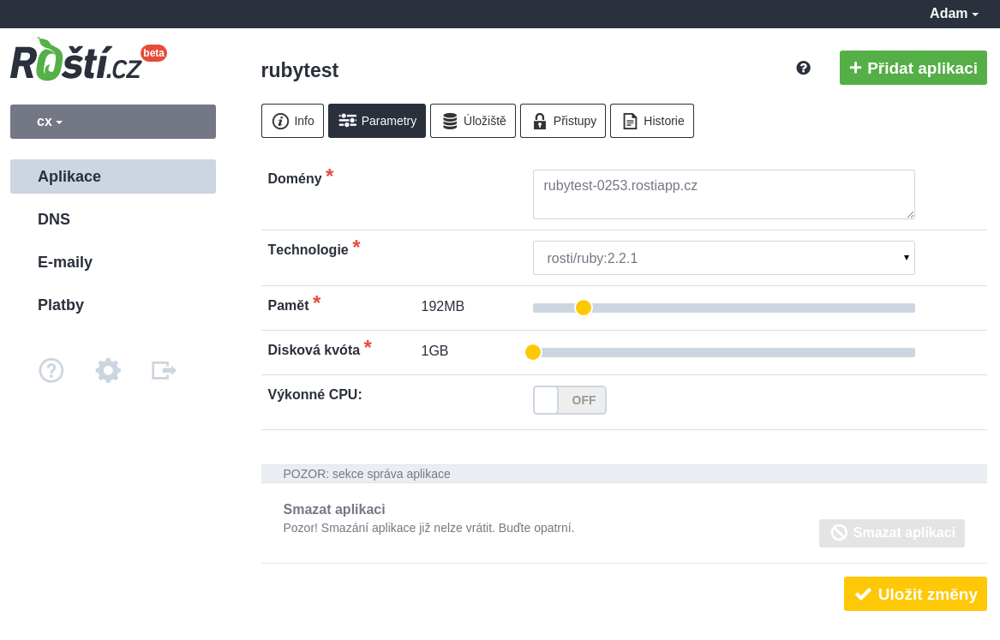

# Ruby

Před čtením následujících řádků se prosím podívejte na stránku se [základními informacemi](../base.md) a [základními pojmy](../aword.md).

Obraz pro Ruby vytváříme kompilací zdrojových kódů ze stránky [ruby-lang.org](http://ruby-lang.org). Díky tomu vám můžeme nabízet nejnovější verze vašeho oblíbeného jazyka. Společně s Ruby obsahuje obraz základní konfiguraci supervisoru a jednoduchou aplikaci, od které se můžete při nasazování vaší aplikace odrazit.

Supervisor je nástroj, který spravuje procesy běžící na pozadí, což vaše aplikace je. Můžete díky němu editovat parametry těchto procesů a můžete libovolně přidávat další, třeba pro zpracování úloh na pozadí nebo pro pravidelné zpracování nějakých dat. Pokud jste se nikdy s nástrojem supervisor nesetkali, odkáži vás zde ještě na [stránku supervisor](../tools/supervisor.md), kde dozvíte vše podstatné.



## Nasazení aplikace

Kontejner s Ruby má na Roští stejnou strukturu jako kontejnery pro jiné technologie, takže pokud už u nás něco hostujete, budete to mít jednodušší. Po připojení do vašeho kontejneru přes SSH nebo SFTP nakopírujte svůj kód do adresáře */srv/app*. Sem patří všechen kód, který má být veřejný.

Ukázková aplikace běží pod webovým serverem Unicorn[](http://unicorn.bogomips.org/)  na portu 8080. Před Unicorn je ještě navěšený váš vlastní Nginx, který Unicornu dělá reverzní proxy a můžete v něm kromě různých přesměrování řešit také cache a servírování statických souborů. Nginx běží na portu 8000, což je port, na který náš load balancer posílá požadavky na nastavené domény.

Pravděpodobně budete chtít trochu poupravit spouštění vašeho kódu a to se dělá v souboru */srv/conf/supervisor.d/ruby.conf*, jehož obsah vypadá podobně jako tento:

```ini
[program:app]
command=/srv/.gem/bin/unicorn -p 8080
...
stdout_logfile=/srv/logs/unicorn.log
```

Konfigurační direktiva *command* obsahuje příkaz, který má supervisor spravovat. Zde nemusí být unicorn, ale můžete uvést jakýkoli webový server, který bude naslouchat na portu 8080 nebo můžete vypnout Nginx a požadavky posílat přímo do *unicornu*. Stačí změnit nastavení parametru *-p*, tedy portu, na *8000*. Všimněte si také direktivy *stdout_logfile*, kde najdete cestu k logu, do kterého se zapisuje výstup vaší aplikace.

Po změnách v tomto souboru můžete načíst změny takto:

```bash
supervisorctl reread
supervisorctl update
```

Restart, start a zastavení aplikace se provádí takto:

```bash
supervisorctl start app
supervisorctl stop app
supervisorctl restart app
```

Podobnosti jsou vysvětlený v textu o supervisoru odkazovaném výše.


## Nginx

Nginx je již nakonfigurovaný a nejčastěji budete přidávat do konfigurace servírování statických souborů. To je možné vyřešit takto:

```
server {
        listen       0.0.0.0:8000;
        listen       [::]:8000;
        location / {
                proxy_pass         http://127.0.0.1:8080/;
                proxy_redirect     default;
                proxy_set_header   X-Real-IP  $remote_addr;
                proxy_set_header   Host       $host;
        }
        location /static/ {
                alias /srv/static/;
        }
}
```

Kde místo */srv/static/* napíšete cestu k vaším statikům.

Po první nasazené aplikaci zjistíte, že vám Roští nestojí v cestě a pokud byste náhodou zjistili že ano, napište nám na technickou podporu. Stačí kliknout na zelenou ikonku vlevo dole.

## Aktualizace/změna obrazu

Změna verze Ruby se provádí pomocí změny obrazu v administraci. Je to jednoduchý krok, ale po provedení vyžaduje i změny ve vašem kontejneru. U Ruby je situace o trochu jednodušší než u Pythonu a stačí smazat adresář *~/.gem* a vytvořit ho znovu pomocí nástroje *bundle*, případně jiného správce gemů.

Po změně obrazu zavolejte toto:

```bash
rm -rf ~/.gem
cd app
bundle install
supervisorctl restart app
```

Smazání adresáře *.gem* je nutné z důvodu nekompatibility rozhraní Ruby v jeho jednotlivých verzích. V některých případech to nutné nebude, ale pořádně si pokaždé aplikaci otestujte, než se rozhodnete kontejner neupravovat.
