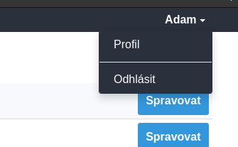
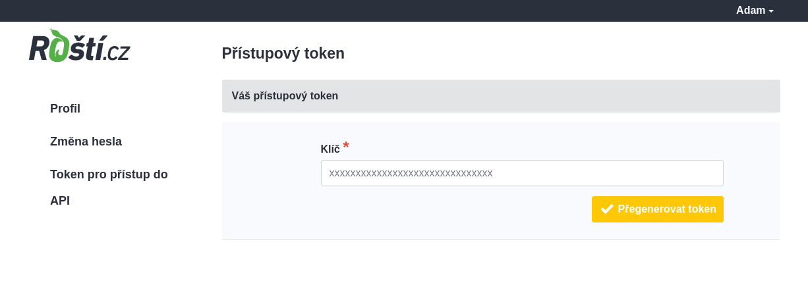

# API

Token pro přístup do API je unikátní pro každého uživatele a jeho získání je trochu schované v pravém horním rohu v administraci.

Po kliknutí vyberte *Token pro přístup do API*.

Token je možné kdykoli přegenerovat, ale každý uživatel může mít jen jeden.

Dokumentace k API je oddělená od této dokumentace, protože je generovaná společně se změnami v kódu a najdete ji na adrese [https://admin.rosti.cz/api/](https://admin.rosti.cz/api/).

