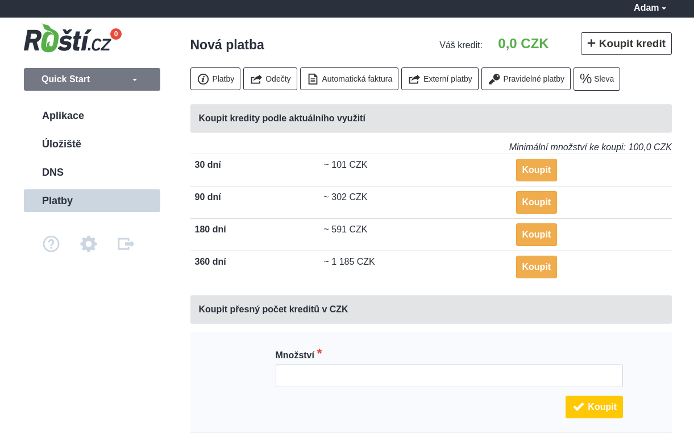

# Platby

Na Roští se platí pouze za běžící aplikaci a to za každou započatou hodinu. Můžete tedy Roští využívat jen na občasné testování nějakých změn a zaplatíte jen za čas, po který testovací aplikace běžela. Pokud aplikaci nepotřebujete, je možné ji vypnout a budete platit pouze za obsazený diskový prostor.

V současné době funguje Roští na kreditový systém a kredit je potřeba dobít před tím, než je využit. Po registraci máte nicméně 30 dní na vyzkoušení.

Pro dobítí kreditu přejděte do sekci *Platby* v administraci a vyberte časový interval spočítaný podle aktuální spotřeby kreditů nebo zadejte přímo částku, kterou chcete dobít.

Po odkliknutí je možné zaplatit přes QR kód, převodem na účet a po rozkliknutí zálohové faktury i kartou. Při vygenerování platby se vytvoří zálohová faktura, kterou neslouží jako daňový doklad. Ten vám bude zaslán automaticky po připsání částky na náš účet nebo na účet GoPay, které se nám stará o platby kartou.

Pokud hosting neuhradíte, dostanete celkem 4 emaily. První dva vás budou informovat on nedostatku kreditu. Třetí o zamčení účtu a vypnutí aplikací a poslední o smazání aplikací. Pokud náhodou ke smazání dojde, můžete se nám během třech dnů ozvat, abychom obnovili vaše data, ale po této době budou data odstraněna i z našich záloh.

V administraci je možné nastavit i automatické generování plateb pod záložkou *Automatická faktura*. Pokud ji zapnete, bude se dobíjet kredit na další nastavitelné období a to v případě, že klesne pod nastavenou hranici. Ta je ve výchozím stavu 50 Kč.

Dále v sekci platby najdete informace o tom, kolik jsme vám za daný měsíc odečetli kreditu a za co pravidelně platíte.
