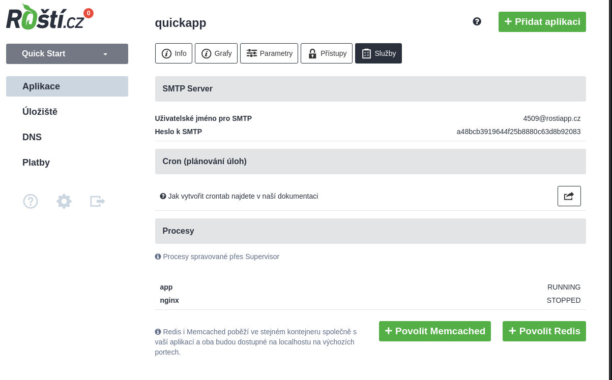

# Memcached a Redis

V kontejnerech s každou aplikací je nainstalován Redis a Memcached, ale ve výchozím stavu nejsou zapnuty. Pokud jedno, druhé nebo obojí potřebujete, nejjednodušší cesta jak je zapnout je přes administraci.

Na této stránce je vidět co všechno v kontejneru běží a je možné kliknutím na *Povolit Memcached* resp. *Povolit Redis* jedno či druhé zapnout. Po kliknutí se v kontejneru vše potřebné nastaví.

Alternativní způsob je použití utility *rosti*. Po přihlášení přes SSH spusťte *rosti*, vyberte services a objeví se takovéto menu:

Tam vyberte službu, kterou chcete aktivovat.

V případě Redisu můžete změnit jeho konfiguraci v souboru */srv/conf/redis.conf*. U Memcached je možné to samé v konfiguraci supervisoru, konkrétně v */srv/conf/supervisor.d/memcached.conf*, konkrétně na řádku začínajícím *command=*.

Pokud je náhodou něco špatně, zkontrolujte logy v */srv/log/*, kam obě služby zapisují svůj výstup.
