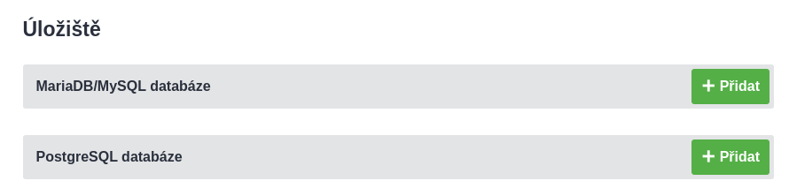
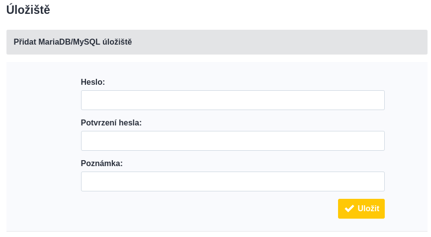
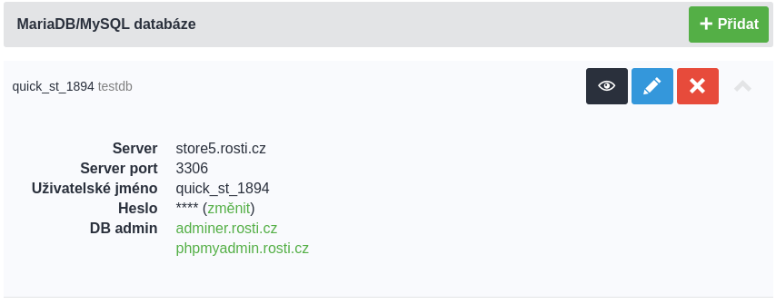

# 3. Databáze

Roští podporuje dvě databáze, které jsou sdílené všemi uživateli. Jde o MariaDB 10.4 a PostgreSQL 12. Databáze průběžně aktualizujeme, ale staré aplikace necháváme běžet na tom, na čem je jejich uživatelé vytvořili. Pokud oznámíme dostupnost nové verze jedné či druhé databáze, můžete aktualizovat tak, že si vytvoříte v administraci databázi novou a zkopírujete tam data z té staré.

Vraťme se teď do rozhraní administrace, konkrétně do sekce *Úložiště*.

Tam vybereme jednu nebo druhou databázi a klikněte na tlačítko *Přidat*.

Heslo si můžete určit sami a nezapomeňte přidat i poznámku. Tam by mělo být napsané k jaké aplikaci databáze patří, případně nějaká jiná její identifikace. Jméno databáze a uživatelské jméno pro přístup k ní budou vygenerovány automaticky. Díky poznámce můžete snadno jednotlivé databáze odlišit.

Po vyplnění formuláře dojde k vytvoření databáze a je čas se k ní připojit.

Začněte kliknutím na tlačítko s ikonou oka. Objeví se základní informace k připojení k vytvoření databázi. V našem případě jde o MySQL databázi na serveru *store5.rosti.cz* a se jménem *quick_st_1894*. Jméno databáze a uživatelské jméno jsou stejné. Můžete se tedy připojit zpět do kontejneru přes SSH a připojit se odtud přímo do této nové databáze:

    mysql -u quick_st_1894 -h store5.rosti.cz -p quick_st_1894

Stejné parametry můžete použít i pri připojení k databázi z vaší aplikace.

## Přístup z internetu

Databáze nemáme přístupné z internetu, ale pokud potřebujete s databází pracovat na svém lokálním počítači, můžete použít SSH tunel. Pro výše vytvořenou databázi se takový tunel tvoří takto:

    ssh -L 127.0.0.1:3306:store5.rosti.cz:3306 -p 24509 app@node-16.rosti.cz

Použili jsme SSH přístup k aplikaci vytvořené v předchozích částech a protunelovali port databáze 3306 na lokální port 3306. **Nezapomeňte změnit port v parametru -p, node a případně adresu databáze**. Ani jedno nemusí být stejné jako v příkladu výše.

Pokud vše proběhlo správně, máte databázi dostupnou stejně jako kdyby běžela na vašem počítači a můžete k ní přistupovat nástroji na které jste zvyklí.

Nezbývá než se přesunout do [poslední části tohoto návodu a to jsou domény](domains.md).
