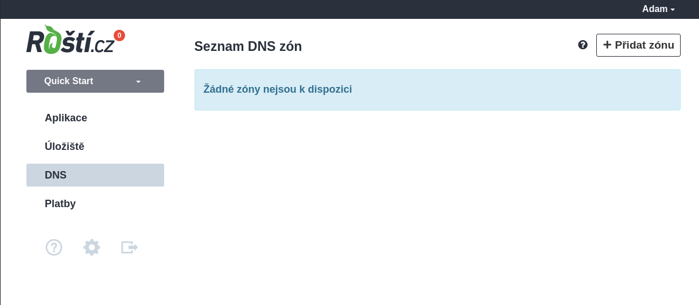
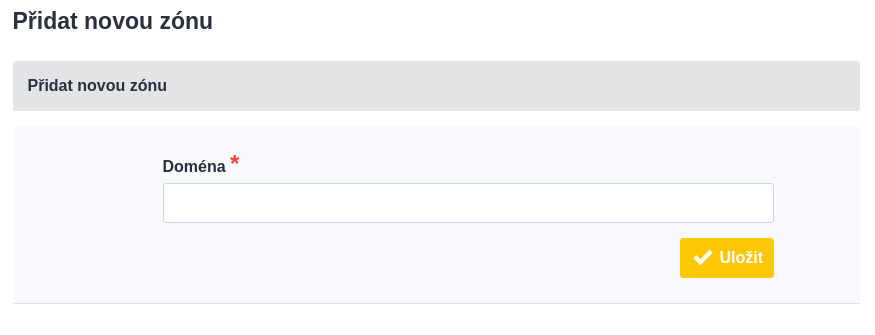
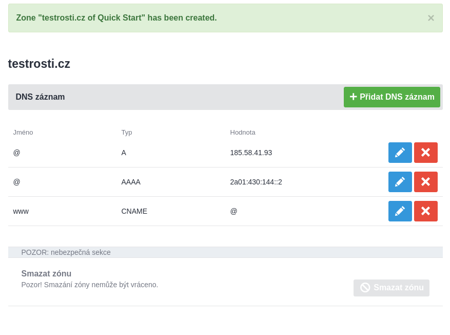
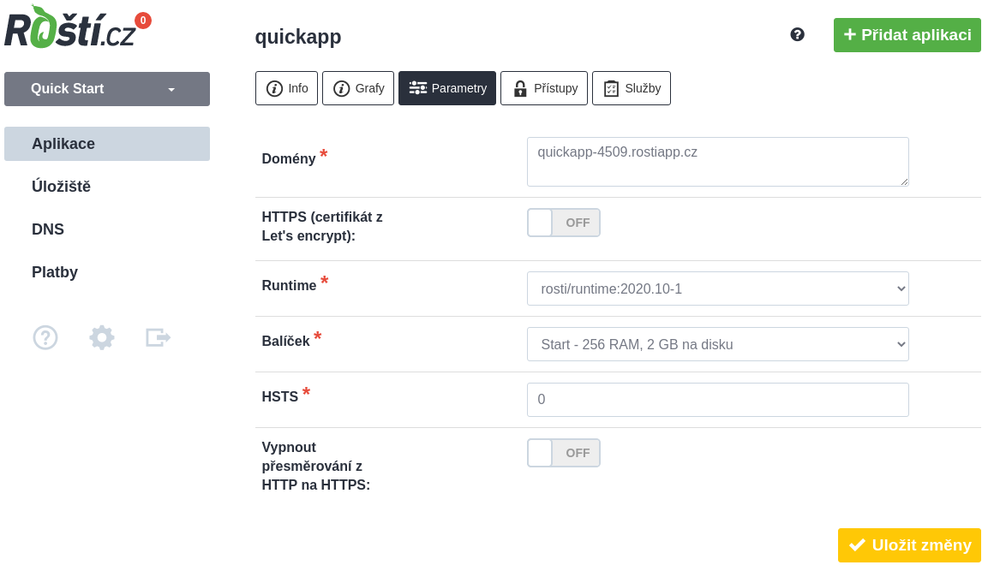

# 4. Domény

Roští není registrátorem domén a tak není možné u nás domény registrovat. Na druhou stranu vám to dává svobodu si vybrat vlastního registrátora, třeba takového, který má domény, které jinde dostupné nejsou. Nicméně na Roští můžete hostovat DNS zóny pro vaše domény, což je také preferovaný způsob, jak k nám domény nasměrovat.

## Nasměrování NS záznamů domény na naše DNS servery

Než začneme, tak přejdeme do administrace, do sekce *DNS* a vytvoříme novou zónu. Tím řekneme NS serverům na Roští, že mají odpovídat na požadavky na záznamy k této doméně.

Klikneme na tlačítko *Přidat zónu*.

Vyplníme název naší domény bez www.

Zóna je připravená pro hosting na Roští, takže pokud u nás budete mít na této doméně jen webovou aplikaci, nemusíte nic dalšího řešit a můžete přejít k samotné registraci domény. Případně můžete DNS záznamy upravit jak potřebujete. Například přidat MX a TXT záznamy pro email nebo další A, AAAA či CNAME záznamy webové aplikace.

Při registraci domény se vyplňují NS servery. Každý registrátor to má implementované trochu jinak a ve výchozím stavu budou použity jeho NS servery. Je tedy nutné je změnit na naše NS servery a to konkrétně na:

* ns1.rosti.cz
* ns2.rosti.cz

U registrace CZ domény je možné použít místo NS serverů tzv. *NSSET*, který je na Roští *ROSTICZ*.

Po zaplacení domény by měla být doména spravovaná našimi NS servery a ve výchozím nastavení na nich bude fungovat *domena.cz* a *www.domena.cz*, kde *domena.cz* nahraďte za jméno registrované domény.

Posledním krok je nasměrování této nové domény do aplikace vytvořené v předchozích částech. Je to krok společný pro možnost nastavení A/AAAA záznamů a tak přeskočte trochu níže na *Nasměrování domény na aplikaci*.

## Nastavení A/AAAA záznamů u domény s DNS zónou mimo Roští.cz

Je možné, že k nám nechcete dávat zónu vaší domény a proto je možné nasměrovat doménu ručně přímo na náš load balancer. Jeho adresy jsou:

| Typ záznamu | IP adresa            |
|-------------|----------------------|
| A           | 185.58.41.93         |
| AAAA        | 2a01:430:144::2      |

Po nastavení DNS záznamů stačí přejít do parametrů aplikace a přidělit doménu či domény ke konkrétní aplikaci, což je popsané v další sekci.

## Nasměrování domény na aplikaci

A tady doménu a případně její www variantu dopíšeme do pole *Domény*. Jednotlivé domény je možné oddělit novým řádkem nebo mezerou. Než změnu potvrdíme, můžeme ještě aktivovat HTTPS, nastavit HSTS nebo změnit balíček.

Je možné, že změny v DNS chvíli potrvají, ale během hodiny by mělo vše fungovat. Doménu, kterou jsme vám dali na testování, můžete používat dál nebo ji smazat.

Tímto máte náš quickstart hotový a víte vše potřebné pro nasazování aplikací na Roští. Rozhodně si ale projděte i další stránky této dokumentace, protože tam mohou být důležité informace, které vám mohou hodit.
