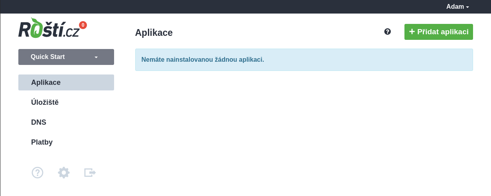
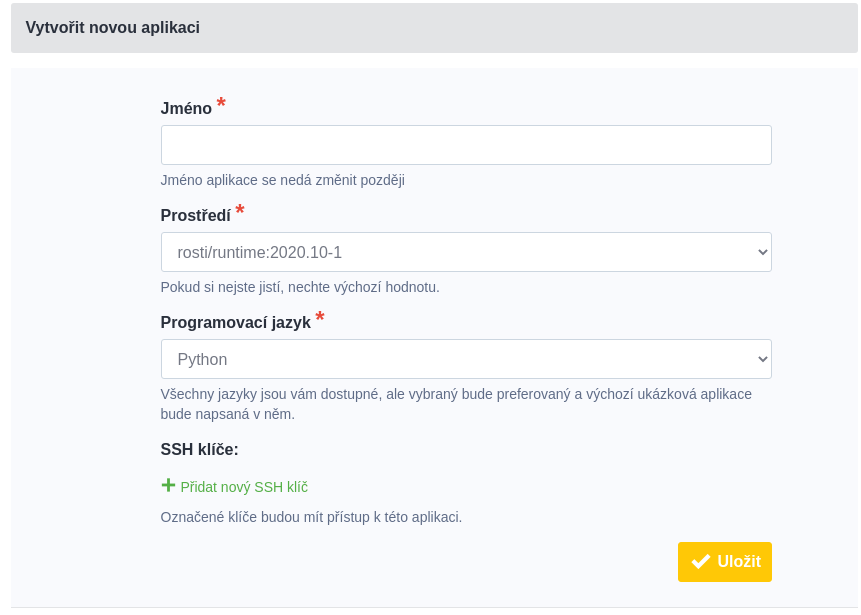
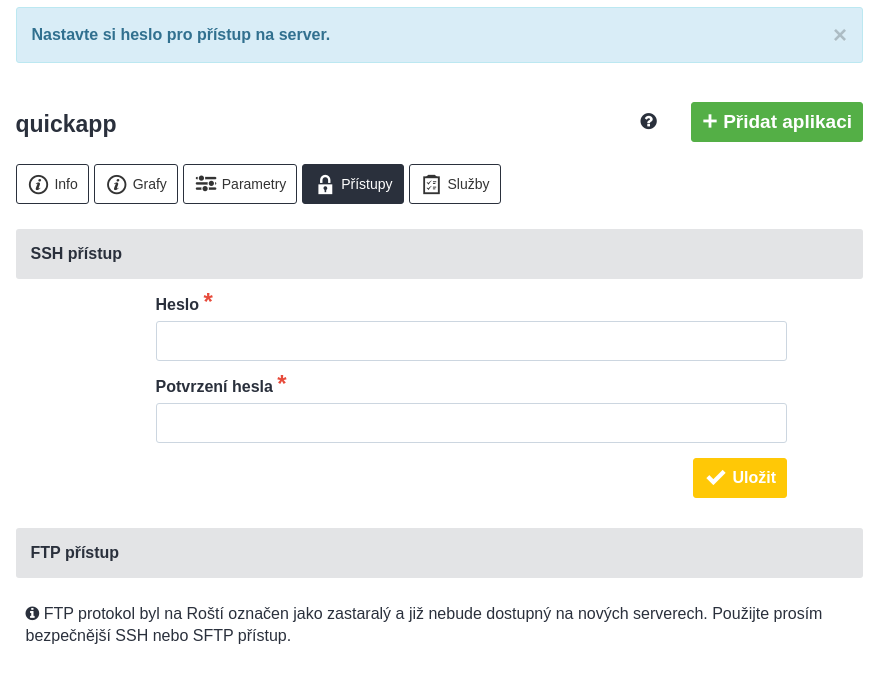
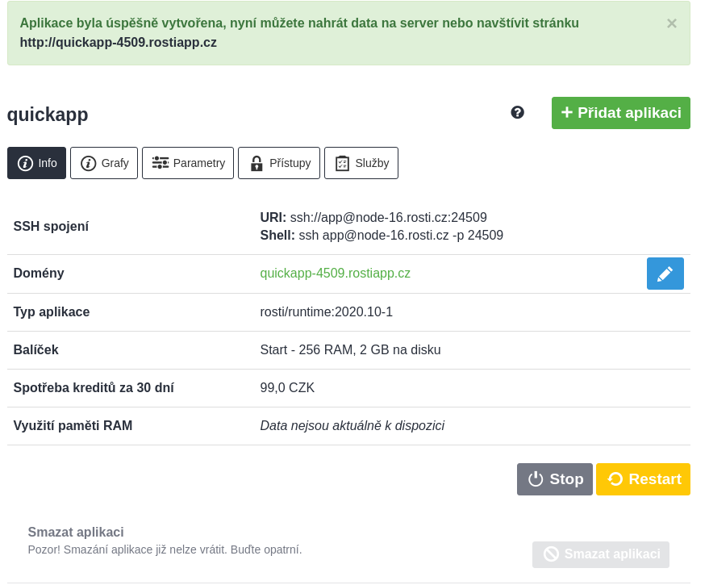

# 1. První aplikace

Po registraci máte 30 dní na to, abyste si naši službu vyzkoušeli. Hned po registraci vypadá administrace podobně jako na obrázku níže.

Když kliknete na tlačítko *Přidat aplikaci*, dostanete se do formuláře, kde můžete zadat pár údajů o tom, co vlastně chcete hostovat.

Jedinou povinnou položkou je jméno aplikace, u kterého si dejte pozor, protože později nejde změnit. V prvním rozbalovacím menu si můžete vybrat verzi Runtime. Runtime je běhové prostředí a jeho verze definuje pro vaši aplikaci dostupné verze PHP, Pythonu, Node.js, ale i systém a systémových nástrojů. Pokud jde o vaši první aplikaci, můžete nechat výchozí hodnotu, což je nejnovější verze.

Další volbou je programovací jazyk. Na výběr máte z možností Python, PHP, Node.js, Deno, Ruby a v případě, že potřebujete hostovat Golang, můžete nechat výchozí Python, protože v takovém případě je postup instalace trochu složitější.

Pokud máte u vašeho účtu nahrán jeden či více veřejných SSH klíčů, můžete je zde vybrat a budou automaticky nainstalovány při vytváření aplikace. Tuto možnost ale prozatím klidně ignorujte.

Po odkliknutí tlačítka *Uložit* se administrace spojí s jedním z našich serverů a spustí na něm Docker kontejner s vybraným Runtime a nastaví load balancer tak, aby si mohli novou aplikace hned vyzkoušet. Ale o tom za chvíli.

Nyní je aplikace již vytvořená, ale administrace vás přesměrovala na formulář, kde můžete nastavit heslo pro přístup na SSH. Vygenerujte si nějaké své heslo a zadejte ho do tohoto formuláře. Po vyplnění budete přesměrováni do info karty aplikace.

Tady najdete několik důležitých údajů:

* Testovací doménu,
* informace k připojení k SSH,
* a informace o parametrech kontejneru a ceně.

U vytvořené aplikace se automaticky nastavuje nejnižší balíček. Pokud potřebujete více výkonu či paměti, tak můžete vybrat jiný balíček v sekci *Parametry*. Ve stejné sekci se dají změnit i domény, ale to pro teď není důležité.

Pod dalšími záložkami na této stránce najdete možnost změnit heslo, mrknout na využití paměti a procesoru nebo přidat do kontejneru Redis nebo Memcached.

Vaše aplikace teď už běží a když kliknete na testovací doménu, otevře se vám "hello world" stránka, kterou můžete nahradit vlastním kódem. Čímž se dostáváme k [nasazení kódu nebo-li deploymentu](new/quickstart/first_deployment.md).
