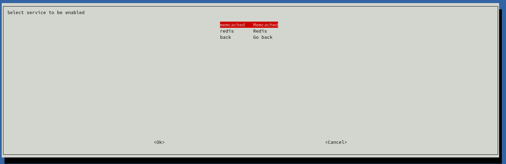

# Nástroj Rosti.sh

Každý kontejner postavený na našem Runtime obraze má v sobě nástroj nazvaný *rosti.sh*, který můžete vyvolat spuštěním příkazu *rosti* přes SSH v kontejneru. Přes tento nástroj můžete aktivovat jednotlivé technologie.

Aktivní může být vždy jen jedna, ale ostatní jsou vám také k dispozici v adresáři */opt/techs*. Pokud například potřebujete k Node.js aplikaci přidat do shellu i Python, přidejte toto do souboru *.bashrc*:

    export PATH=/opt/techs/python-3.9.1/bin:$PATH

Podobně to můžete provést i s ostatními technologiemi.

Dále *rosti.sh* nabízí možnost aktivování Redis a Memcached databází a je to také jediná cesta jak změnit verzi technologie.

## Změna verze technologie

Při instalaci je vybrána jedna výchozí verze Pythonu, PHP, Node.js a dalších a pokud v administraci změníte verzi Runtime, uvnitř kontejneru nedojde ke změně verzí těchto technologií. Z Runtime postupně starší verze technologií odstraňujeme, abychom uvolnili místo pro nové.

Pokud tedy chcete například aktualizovat Python v prostředí vašeho kontejneru, spusťte příkaz *rosti*, vyberte v menu *tech* a pak verzi, kterou potřebujete.

Přepnutí probíhá tak, že se změní symlink do:

    /srv/bin/primary_tech

Po změně restartujte běžící aplikaci:

    systemctl restart app

A znovu se přihlaste přes SSH, aby se načetl aktualizovaný soubor *.bashrc*. Samozřejmě se ujistěte, že všechno běží jak má.

Dejte si pozor kdy tuto změnu děláte, protože u některých technologií velmi pravděpodobně rozbijete prostředí, kde běží vaše aplikace. Předtím, než změnu provedete, podívejte se do dokumentace k jednotlivým technologiím, co tam píšeme o jejich aktualizaci.
