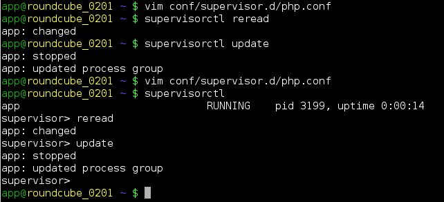

# Supervisor

Supervisor je klíčovou součástí všech obrazů na Roští a pokud chcete Roští využívat naplno, musíte vědět, jak ho použítvat. Supervisor je hlavní proces všech našich Docker obrazů a hlídá, že vaše aplikace běží. Pokud by náhodou spadla, pokusí se ji znovu nahodit. Oficiální dokumentaci [naleznete na supervisord.org](http://supervisord.org/).

V nově vytvořených aplikacích běží pod supervisorem jeden až dva procesy, což je ukázková aplikace, která vám má dát funkční příklad toho, jak Roští vypadá a k ní ještě bývá Nginx (Python a Ruby). Konfigurace supervisoru se nachází v adresáři */srv/conf/supervisor.d/*. Když si ho otevřete například v Node.js aplikaci, uvidíte soubor *node.js* s tímto obsahem:

```ini
[program:app]
command=/opt/node/bin/npm start
environment=PATH="/usr/local/bin:/usr/bin:/bin:/usr/local/games:/usr/games:/opt/node/bin"
directory=/srv/app
autostart=true
autorestart=true
stdout_logfile=/srv/log/node.log
stdout_logfile_maxbytes=2MB
stdout_logfile_backups=5
redirect_stderr=true
```

Tímto souborem říkáme supervisoru, že má spravovat program s názvem *app*, spustit ho pomocí */opt/node/bin/npm start* a že prostředí má mít upravenou proměnnou *PATH*, kde se nacházejí cesty, ve kterých systém hledá spustitelné soubory. Další parametry jsou:

|Parametr|Funkce|
|-|-|
|directory|Pracovní adresář, ve kterém je proces uvedený v *command* spuštěn|
|autostart|Zda má proces automaticky nastartovat s kontejnerem|
|autorestart|Zda se má proces automaticky restartovat při chybě|
|stdout_logfile|Kam se má logovat výstup procesu|
|stdout_logfile_maxbytes|Maximální velikost logu|
|stdout_logfile_backups|Počet souborů s logy o velikosti uvedené v *stdout_logfile_maxbytes*|
|redirect_stderr|Přesměrování chybového výstupu do stdout, výsledkem jsou oba výstupy přesměrované do soubor uvedeném v *stdout_logfile*|

## Přidání nového procesu

Když zkopírujete konfiguraci výše a vyplníte jiný parametr *program*, *command* a *stdout_logile*, můžete takto provozovat libovolný počet dalších procesů. Například administrace Roští používá Python RQ workery, které jsou tímto způsobem spouštěny na pozadí. Když přes administraci kliknete na nějakou akci, ta se přesune na pozadí a provede ji jeden z těchto workerů.

## Ovládání

Supervisor se ovládá velmi snadno a to přes nástroj *supervisorctl*. Když přidáte nový konfigurák, zavoláte následující:

```basb
supervisorctl reread
supervisorctl update
```

Akce *reread* načte znovu konfiguraci a *update* porovná současnou konfiguraci s tou načtenou a provede vše co je potřebné, aby současný stav korespondoval s tím v nové konfiguraci.



Někdy ale potřebujete proces zastavit, spustit nebo restartovat. To se dělá následovně:

```basb
supervisorctl start app
supervisorctl stop app
supervisorctl restart app
```

Kde místo *app* bude název uvedený za *program:*. Pokud zavoláte:

```bash
supervisorctl status
```

Objeví se seznam procesů a jejich stav.

## Shrnutí

Supervisor vám umožní spolu s aplikací provozovat u nespočet dalších daemonů. Například si můžete spustit libovolný počet memcached instancí, či Redisů, díky Supervisoru vám můžeme dát kontrolu nad vlastním Apachem nebo Nginxem a dostanete se velmi blízko tomu, co byste měli s virtuálním serverem, ale vše máte již připravené.
