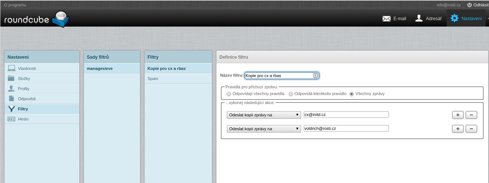

## E-mailové schránky

**Emailové služby na Roští.cz 31.5.2018 končí. O možnostech kam můžete svou poštu přesunou se dozvíte [zde](end_of_emails).**

E-mailové schránky na Roští mohou mít kapacitu až 25 GB, neomezený počet e-mailů a je možné je vybírat přes protokol POP a IMAP. Veškerá e-mailová komunikace je spravována servery **mail.rosti.cz** a **smtp.rosti.cz**. Nastavení vašeho klienta by tedy mělo vypadat takto:

|Parametr|Hodnota|Poznámka|
|-|-|-|
|Uživatelské jméno|vas@email.tld|celý váš mail, platí pro SMTP, IMAP i POP|
|Heslo| \*\*\*\*\*|Heslo nastavené v administraci, platí pro SMTP, IMAP i POP. Je nutné ho poslat jako PLAIN, někdy též označeno jako *normální heslo*|
|SMTP server|smtp.rosti.cz|Přihlášení pro SMTP, POP a IMAP je stejné|
|SMTP port  | 587 | Pro odesílání pošty nepoužívejte port 25, je často blokovaný poskytovateli připojení k internetu |
|IMAP server|mail.rosti.cz|IMAP podporuje PUSH notifikace (pro váš telefon)|
|POP server|mail.rosti.cz|Zastaralý, doporučujeme nepoužívat|
|Šifrování|*TLS*, někdy též *starttls*|Je nutné zapnout, bez něj nejede přihlašování|
|Webový klient|[https://mail.rosti.cz/](https://mail.rosti.cz/) |Aplikace RoundCube|

Když se vás e-mailový klient zeptá, zda chcete použít IMAP či POP, vyberte IMAP. U mobilních telefonů obzvlášť. IMAP čte ze serveru pouze meta informace a zprávy se drží na serveru. Díky tomu můžete spravovat svoji emailovou schránku z webového rozhraní, z desktopového klienta či z mobilního telefonu. IMAP navíc podporuje PUSH notifikace, díky kterým se váš telefon nemusí dotazovat, zda dorazil nový email, ale server telefon sám upozorní, až k tomu dojde - což šetří baterii.

## SPF a DKIM

SPF je záznam v DNS zóně vaší domény, který říká ostatním mail serverům, z jakých serverů bude chodit vaše pošta. Když pak někdo bude posílat emaily ze serverů mimo tento seznam, příchozí server bude vědět, že jde o spam a takové zprávy odmítne nebo s nimi bude zacházet opatrněji. SPF nastavujeme pro domény se zónou u nás automaticky. U starších domén ale může záznam chybět a nemůžeme ho doplnit automaticky, protože nevíme, odkud poštu ve skutečnosti odesíláte.

SPF záznam si můžete doplnit sami. Pro Roští servery vypadá takto:

    @ TXT "v=spf1 include:spf.rosti.cz ~all"

Pokud odesíláte poštu i z jiných serverů, použijte [tento nástroj](http://www.spfwizard.net/) na generování SPF záznamů.

Druhou technologií pomáhající se spamem je DKIM. Tentokrát jde o to, že zprávy odcházející ze serveru *smtp.rosti.cz* jsou podepisovány naším privátním klíčem. Veřejnou část klíče si umístíte do DNS zóny a servery, kterým od vás chodí pošta, tento podpis porovnávají s tím, co najdou v zóně vaší domény. Díky tomu server zjistí, zda zpráva šla ze serveru, který má privátní klíč a může se lépe rozhodnout, zda se jedná či nejedná o spam. Zóny vedené na Roští mají DKIM záznam nastavený automaticky a to i zpětně, pokud používáte náš mail server. Emaily jsou podepisované jen pokud jdou ze serveru *smtp.rosti.cz*. Server mail.rosti.cz emaily nepodepisuje a neměli byste ho používat pro odesílání pošty.

Záznam pro ověření DKIM podpisu vypadá na Roští takto:

    smtp01._domainkey TXT "v=DKIM1;p=MIIBIjANBgkqhkiG9w0BAQEFAAOCAQ8AMIIBCgKCAQEAwshse77EJncuF104/Sl6HsafJxEmBPUoBduGKgcDbt8jwio4/Frz6k98+ZA1woMEhUWt72McktdVVf/kcGubdOA+AMnqvYRJzQAYQsAOUJzZDt/nRvBwYkuoVbrNrdnw8KN/s/T3lGWXDKf1Ly4knWZhStw8RNCr2+km4A78ab/ufvSggWj2A+nE5L3Vb8DRldJ7IatWsOC8su3vBMMVt5wYR1TfHDgP878RlDfXkGFLUzN+Uh8uc9+m7WHt7oM4wNMoBazjJJqKq4mF80YNXFKvEtL7Qzy7DPYYylSCNcYyOKwNmj8lNZiO1EHHe2qMGszepA33AecaWZdW8UhgUwIDAQAB"

Oba záznamy výše je důležité nastavit kvůli velkým emailovým službám, které jejich přítomnost v zóně domény vyžadují. Bez toho vám nepůjde odeslat email třeba na Hotmail, Office 365 a může se stát, že je Gmail bude označovat za nedůvěryhodé nebo za spam.

## Webové rozhraní

Základní přístup ke všem schránkám máte přes webové rozhraní na adrese https://mail.rosti.cz/. Čeká tam na vás webový IMAP klient [RoundCube](https://roundcube.net/), přes kterého můžete plnohodnotně spravovat svoji e-mailovou schránku. Je v češtině a používá se velmi podobně jako ostatní emailoví klienti, například jako Seznam.cz.

Pokud potřebujete ze schránky nastavit přesměrování do dalších schránek nebo rozřazovat emaily, dělá se to v Roundcube. Klikněte na *Nastavení->Filtry*. Filtry jsou rozdělené na *Sady filtrů* a jednotlivé filtry. Jako ukázka vám poslouží obrázek níže. **Na Roští nepodporujeme aliasy**, pouze přesměrování přes filtry.

 

Sady filtrů můžete definovat například pro různé situace, třeba když jedete na dovolenou nebo když chcete přesměrovat poštu na kolegu a pak celé sady najednou povolit či zakázat. Filtry samotné mohou zprávy testovat na odesílatele, příjemce, obsah předmětu nebo i obsah samotné zprávy. Dostupnými akcemi je přesun do složky, vymazání, smazání, odeslání na jinou e-mailovou adresu a další.

